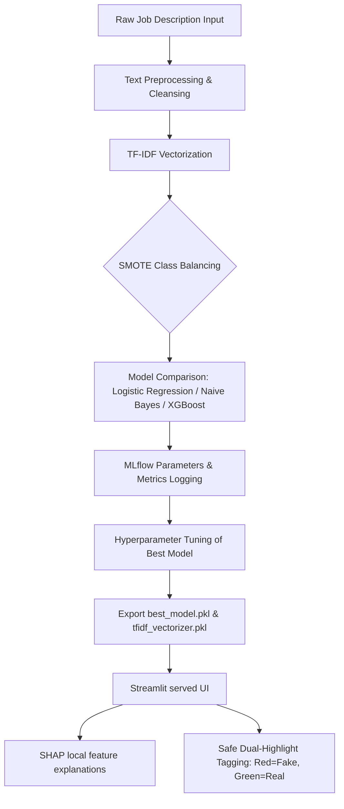
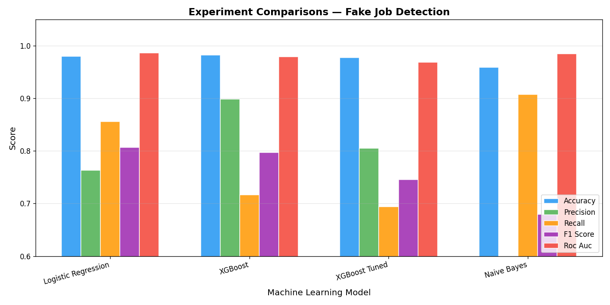
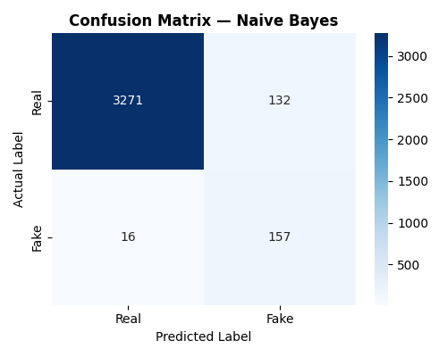

# 🔍 Fraudulent Job Posting Detector & Explainable AI Dashboard

[](https://www.python.org/)
[](https://streamlit.io/)
[](https://mlflow.org/)
[](https://github.com/slundberg/shap)
[](https://opensource.org/licenses/MIT)

An end-to-end, high-performance **Machine Learning & NLP** application designed to protect job seekers by identifying **fraudulent job listings** before they fall victim to employment scams. 

This project incorporates **SMOTE class balancing**, compares multiple classifiers (**Logistic Regression, Naive Bayes, and XGBoost**), tracks all parameters and model artifacts dynamically using **MLflow**, and explains individual predictions using **SHAP (SHapley Additive exPlanations)**. The final model is served through a beautiful, state-of-the-art **Streamlit interactive dashboard** featuring custom dark-mode aesthetics, word-level explainability, and dual-color token highlighting.

---

## 🖼️ Project Showcase & Screenshots

### 🖥️ Streamlit Interactive Web Application
*This section contains screenshots of the prediction interface, interactive controls, and individual text breakdown.*

```markdown
<!-- ================================================================= -->
<!-- 📥 PLACE YOUR FRONTEND SCREENSHOTS HERE                          -->
<!-- Drag and drop your screenshots of the Streamlit application below -->
<!-- ================================================================= -->
```

#### **1. Main Predictor Dashboard (Example)**
> *Paste your main dashboard interface screenshot below showing the prediction cards (REAL/FAKE) and the risk probability gauge.*
>
> **[Placeholder for Main Predictor Screenshot]**
> ``

#### **2. Word-Level Explainability Chart & Dual-Highlight Text Area**
> *Paste the close-up screenshot showing the SHAP horizontal bar chart, the green/red words breakdown, and the newly implemented dark-slate text highlighting container with green (authentic) and red (scam warning) badges.*
>
> **[Placeholder for Explainability and Highlighting Screenshot]**
> ``

---

### 📊 MLflow Tracking Dashboard
*This section contains screenshots showing the experimental runs, parameters, and logged metric comparisons in the MLflow web interface.*

```markdown
<!-- ================================================================= -->
<!-- 📥 PLACE YOUR MLFLOW SCREENSHOTS HERE                            -->
<!-- Drag and drop your MLflow Dashboard screenshots below             -->
<!-- ================================================================= -->
```

#### **1. Experiment Runs Comparison Table**
> *Paste the screenshot of your local http://localhost:5000 MLflow dashboard showing the logged runs sorted by F1-Score.*
>
> **[Placeholder for MLflow Dashboard Runs Screenshot]**
> ``

#### **2. Metric Parameter Scatter / Bar Charts**
> *Paste the screenshot showing the parallel coordinates plot or bar comparison logged inside MLflow.*
>
> **[Placeholder for MLflow Charts Screenshot]**
> ``

---

## 📂 Project Architecture

```
├── app.py                      # Premium Streamlit UI (Predictions, SHAP, and MLflow summaries)
├── mlflow_experiments.py       # ML Pipeline (Text cleaning, SMOTE, MLflow logging, Tuning)
├── requirements.txt            # Python environment dependencies
├── fake_job_postings.csv       # Merged Kaggle dataset (Download required)
├── best_model.pkl              # Saved highest-performing ML model (Auto-generated)
├── tfidf_vectorizer.pkl        # Saved TF-IDF feature extractor (Auto-generated)
├── tfidf_vectorizer.pkl        # Saved TF-IDF feature extractor (Auto-generated)
├── mlflow.db                   # Local SQLite database for MLflow runs (Auto-generated)
└── mlruns/                     # Local MLflow runs metadata directory (Auto-generated)
```

---

## ⚙️ How It Works (The ML Pipeline)



1. **Preprocessing**: Merges and cleanses text fields (title, company profile, description, requirements, benefits) by applying tokenization, lowercasing, URLs/HTML tag stripping, lemmatization, and stop-word filtering.
2. **SMOTE Balancing**: Solves severe class imbalance (the dataset is roughly ~95% real and ~5% fake) using Synthetic Minority Over-sampling to improve fraud detection sensitivity (recall).
3. **TF-IDF Encoding**: Converts textual data into a numerical matrix representing up to 10,000 top bigrams and unigrams.
4. **Explainable AI (SHAP)**: Extracts individual word impact values for each job posting locally, explaining exactly why the AI classified the text as Real or Fake.
5. **Session State Persistence**: Uses Streamlit's `st.session_state` to prevent inputs from disappearing when analyzing job posts or toggling examples.

---

## 🚀 Quick Start Guide

### 1. Install Dependencies
Clone the repository and install the required Python libraries:
```bash
pip install pandas numpy matplotlib seaborn scikit-learn xgboost nltk \
            shap mlflow streamlit imbalanced-learn joblib scipy
```

### 2. Add the Dataset
* Download the dataset from Kaggle: [Real or Fake — Fake Job Posting Prediction](https://www.kaggle.com/datasets/shivamb/real-or-fake-fake-jobposting-prediction).
* Place the file `fake_job_postings.csv` in the root of the project directory.

### 3. Run Experiments & Train Models
Train the classifiers, perform hyperparameter tuning, and export the best model:
```bash
python mlflow_experiments.py
```
This script trains all models and saves `best_model.pkl` and `tfidf_vectorizer.pkl` automatically.

### 4. Start the Interactive Streamlit UI
Start the web dashboard locally:
```bash
streamlit run app.py
```
* Visit **http://localhost:8501** in your browser.
* Paste any job details, load preloaded examples, adjust SHAP display sliders, and inspect results.

### 5. Launch the MLflow UI
View logged parameters, runs, and artifacts:
```bash
mlflow ui
```
* Open **http://localhost:5000** to compare F1-Scores, precision, recall, and ROC-AUC metrics visually.

---

## 📈 Experiment Evaluation Results

Here are the pre-generated evaluation charts logged during model training:

### Model Performance Metrics (All Experiments)
Shows the comparative F1-Score, accuracy, precision, and recall logs across models.


### Model Confusion Matrices (Classifications)
A closer look at how each model handled predictions (True Positives vs. False Positives):

| XGBoost (Tuned) | Logistic Regression | Naive Bayes |
|---|---|---|
|  |  |  |

---

## 📜 License & Acknowledgement

* **License**: MIT License.
* **Dataset**: Dataset provided by the University of the Aegean. Special thanks to Kaggle user `shivamb` for sharing the dataset.
